#  Levantamiento del proyecto asignado desde el fork

El proyecto asignado se levantó a partir del **fork** realizado en GitHub, disponible en el siguiente enlace:  
[Repositorio Fork – PublicMunicipalWorks_DWH](https://github.com/Francesbran23/PublicMunicipalWorks_DWH)

---

## 1. Creación del fork y clonación en local
En primer lugar, se generó el **fork** desde la página principal del repositorio en GitHub, lo cual permitió contar con una copia independiente para realizar modificaciones y pruebas.  

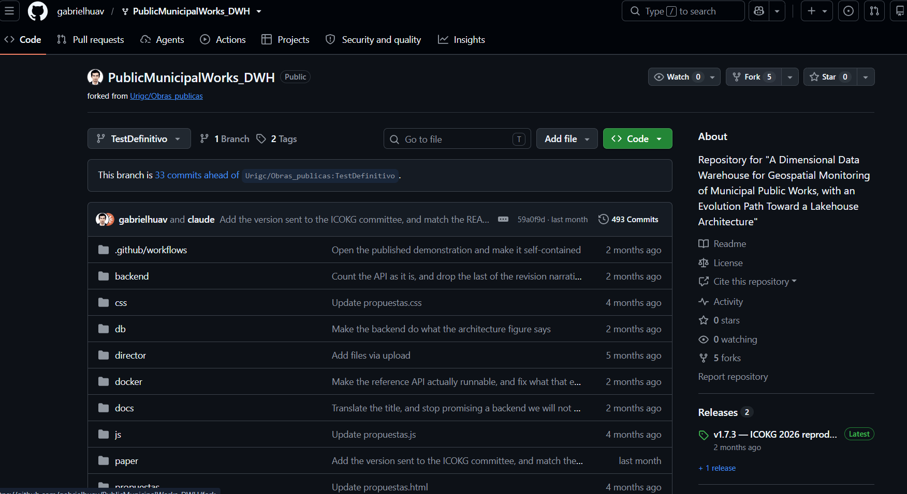

Posteriormente, este fork se clonó en la máquina local mediante el comando correspondiente, siguiendo las instrucciones especificadas en el archivo **README** del proyecto.  

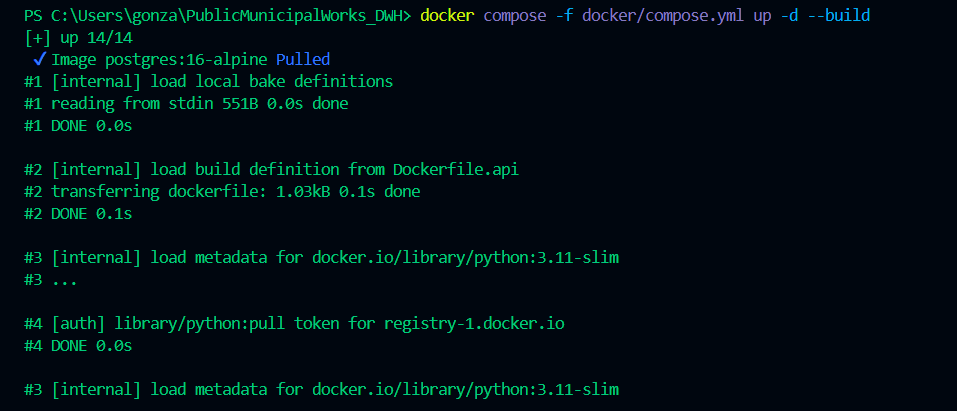

---

## 2. Ejecución de Docker Compose
Una vez clonado, se procedió a levantar los servicios definidos en el archivo `docker-compose.yml`. Durante este proceso surgió un pequeño inconveniente relacionado con los permisos de acceso a directorios compartidos.  

Este problema se solucionó configurando la opción de **File Sharing** en Docker Desktop, lo que permitió que los volúmenes se montaran correctamente y que los scripts de inicialización de la base de datos se cargaran sin errores.  

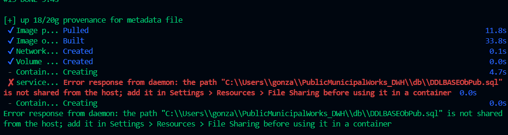  
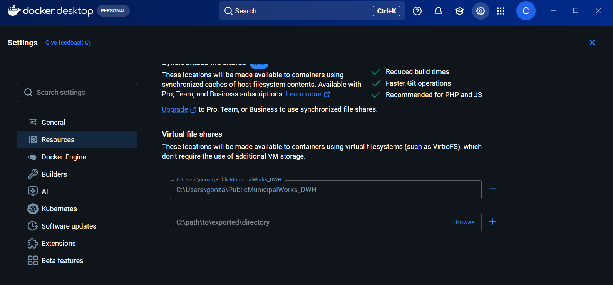

---

## 3. Verificación desde la terminal
Con la configuración corregida, se ejecutaron nuevamente los comandos de inicialización en la terminal. Se verificó el estado de los contenedores y la correcta creación de la base de datos mediante consultas directas desde la línea de comandos.  

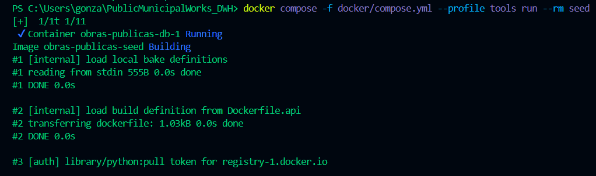  
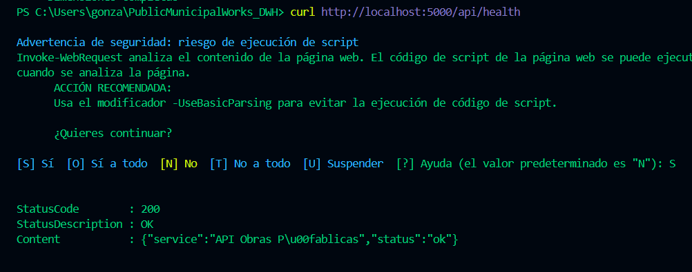  

---

## 4. Conexión a la base de datos con pgAdmin4
Para validar la persistencia y el acceso a la base de datos, se utilizó **pgAdmin4**. Se registró un nuevo servidor con los parámetros definidos en el `docker-compose.yml`:

- **Host**: `localhost`  
- **Puerto**: `55432`  
- **Base de datos**: `obras_publicas`  
- **Usuario**: `obras`  
- **Contraseña**: `obras_local`  

La conexión fue exitosa y se pudo explorar la estructura de tablas y esquemas cargados automáticamente desde los archivos `.sql` montados en el volumen.  

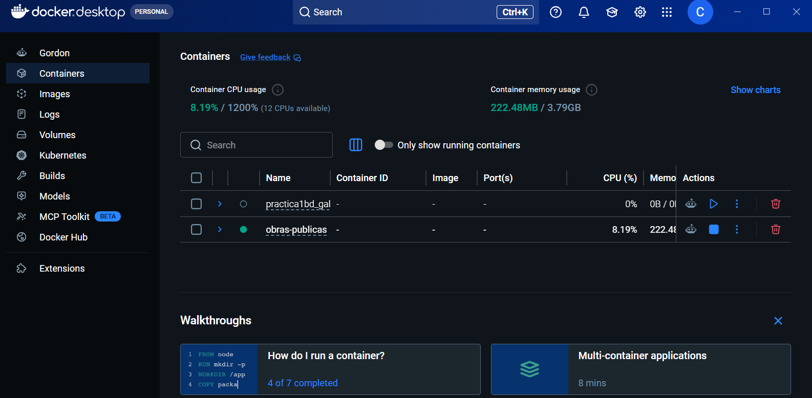  
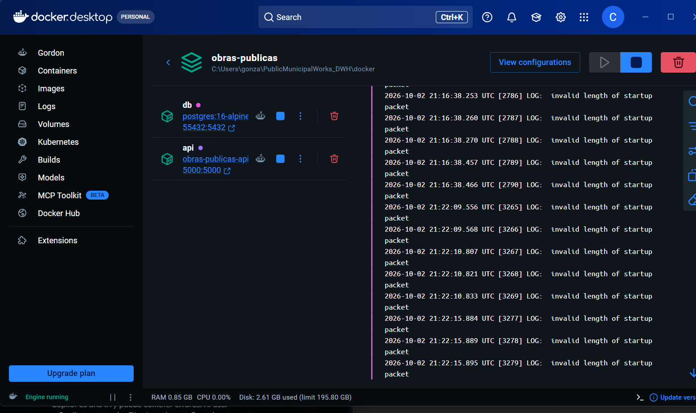  
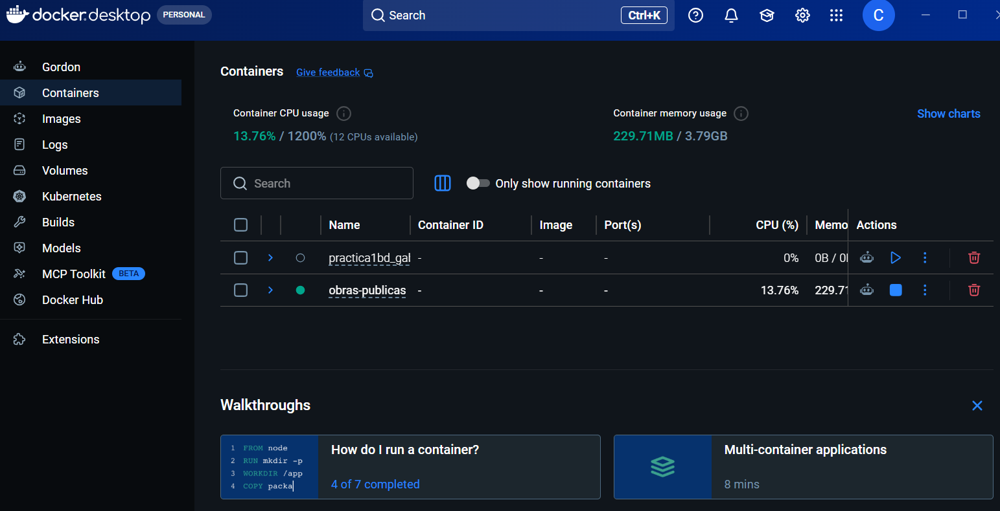  
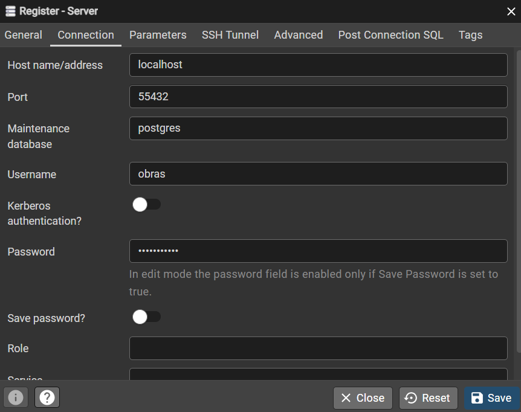  
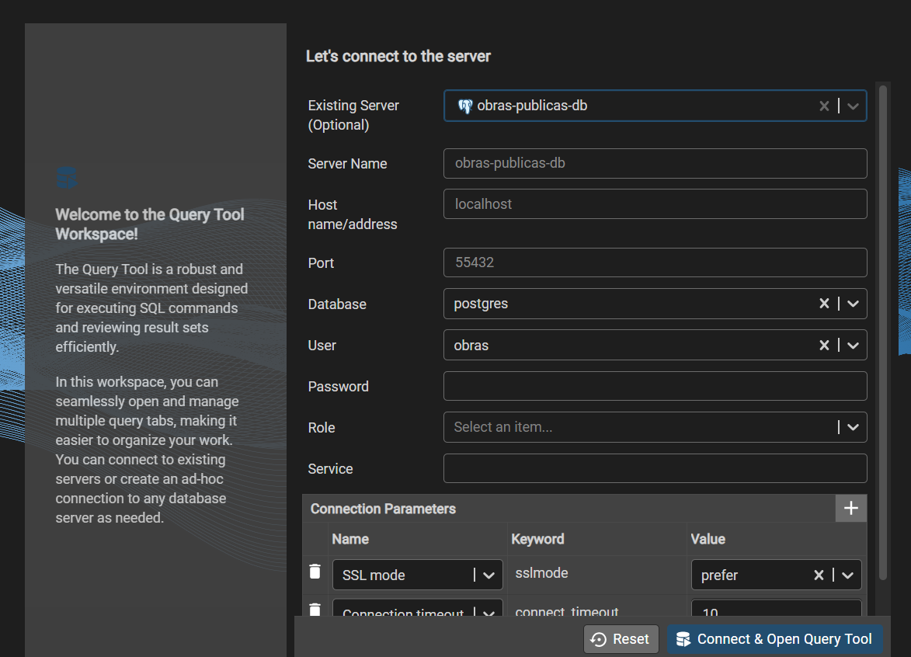  
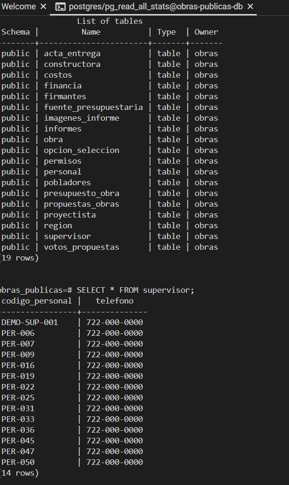  
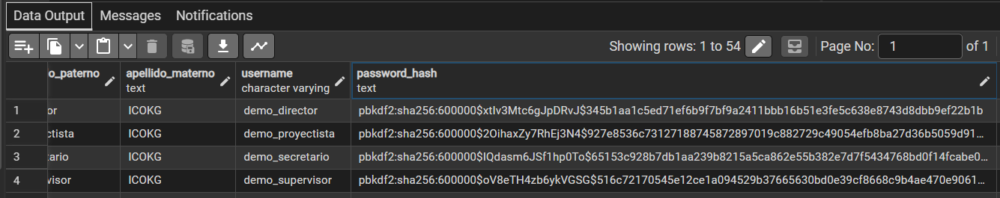  
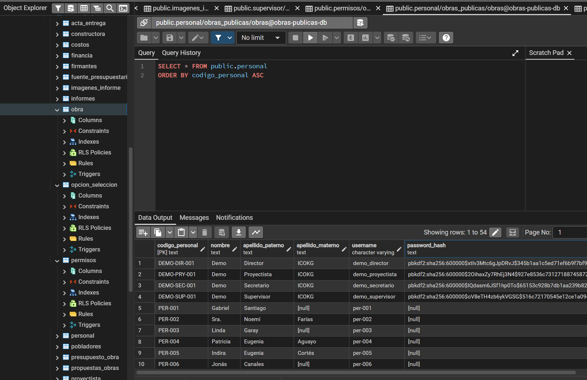  
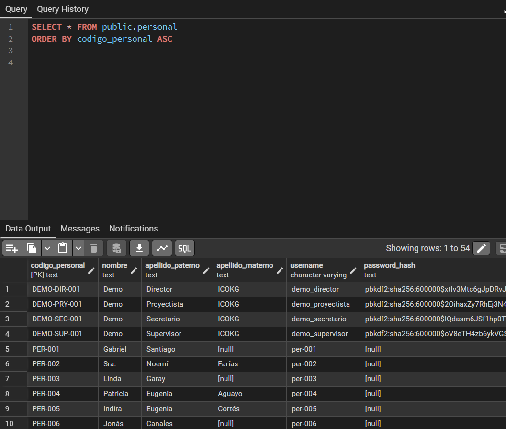  
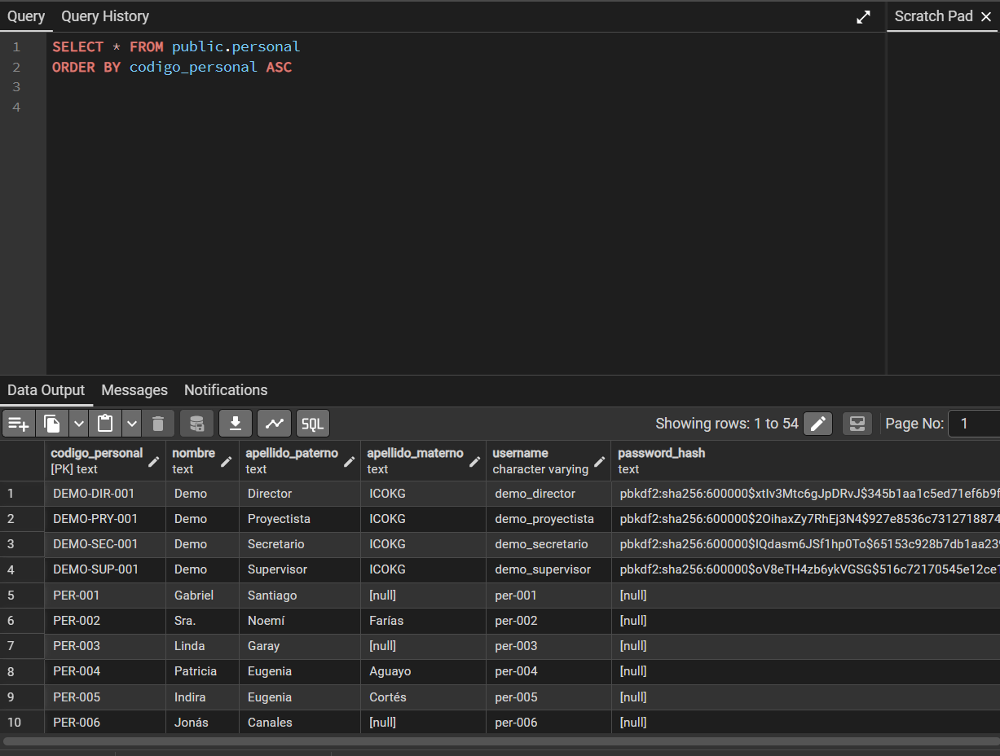  
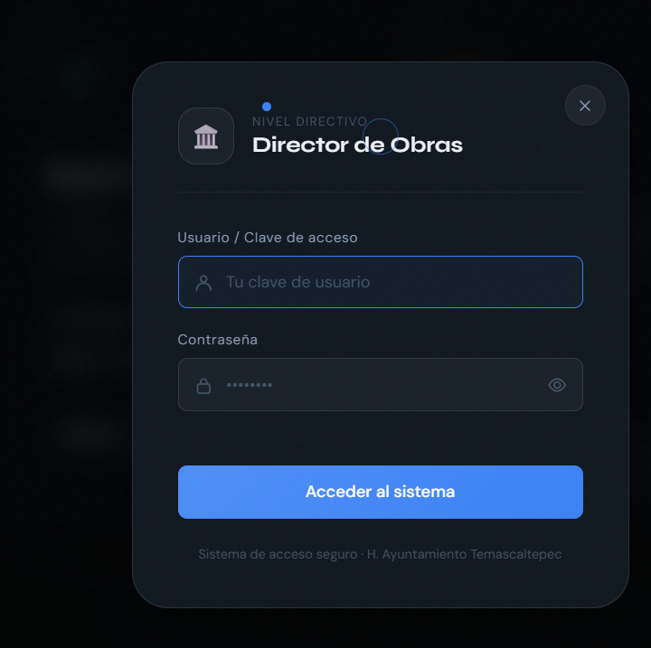

---

## 5. Problema con autenticación en el sistema
Al intentar acceder al sistema completo, surgió un error relacionado con las credenciales y la autenticación. Este error se manifestó al momento de ingresar al sistema con las contraseñas configuradas.  

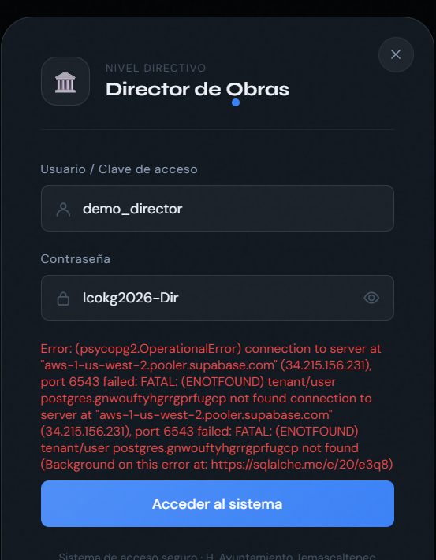

Se intentó resolver el problema mediante ajustes en **Supabase**, sin embargo, la solución no fue inmediata y se identificó que se trata de un error más profundo en la configuración de dicho servicio.  

---

## 6. Próximos pasos
El proyecto quedó levantado en local con la base de datos funcional y accesible desde pgAdmin4. No obstante, el error de autenticación en Supabase requiere una revisión más detallada en futuras sesiones para garantizar el correcto funcionamiento del sistema completo.  

